# GIIS Editor

A 2D/3D graphics editor built in Java 21 featuring implementations of classic computer graphics algorithms.

## Features

### Drawing Tools

- **Pen** - freehand drawing
- **Lines** - line segments with algorithm selection (Bresenham, CDA, Straight Line)
- **Antialiasing** - line smoothing

### Curves

- **Circle** - by center and radius
- **Ellipse** - by two foci
- **Parabola** - by vertex and point
- **Hyperbola** - by foci

### Polygons

- **Arbitrary Polygon** - by set of points
- **Triangle** - isosceles, right-angle
- **Quadrilaterals** - rectangle
- **Regular n-gon** - with specified number of vertices
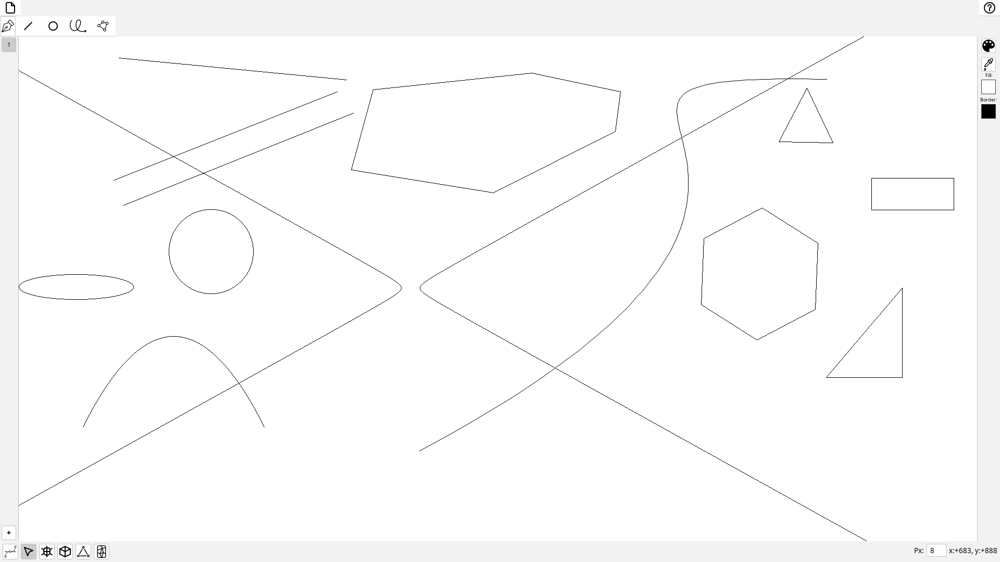
### Fill Algorithms

- **Simple Seed Fill** - classical seed fill
- **Scanline Seed Fill** - scanline seed fill algorithm
- **Scanline AEL/OEL Fill** - active edge list algorithms

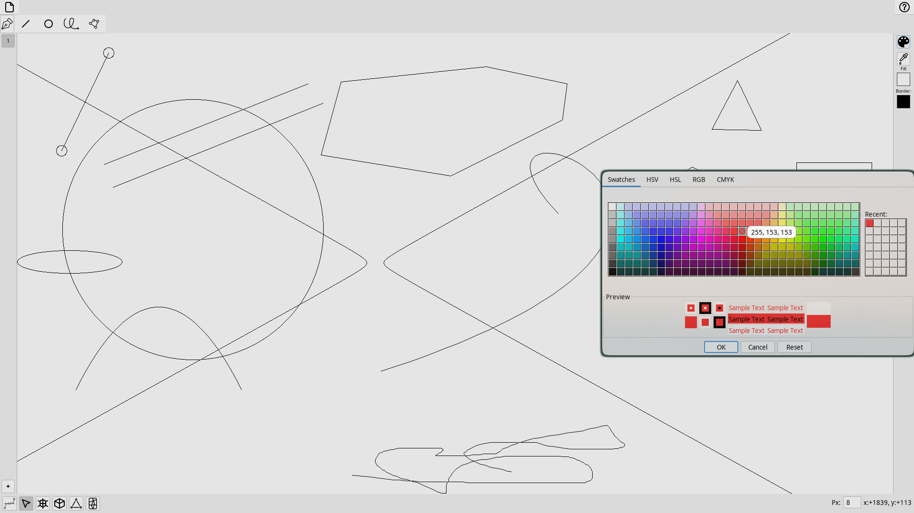

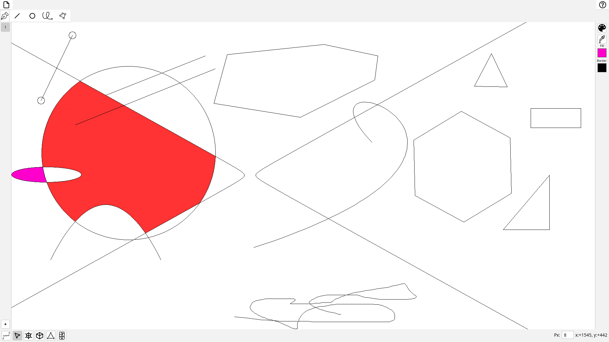

### Convex Hull

- **Graham Scan** - Graham scan algorithm
- **Jarvis March** - Jarvis march algorithm

### Triangulation

- **Delaunay** - Delaunay triangulation
- **Voronoi** - Voronoi diagram

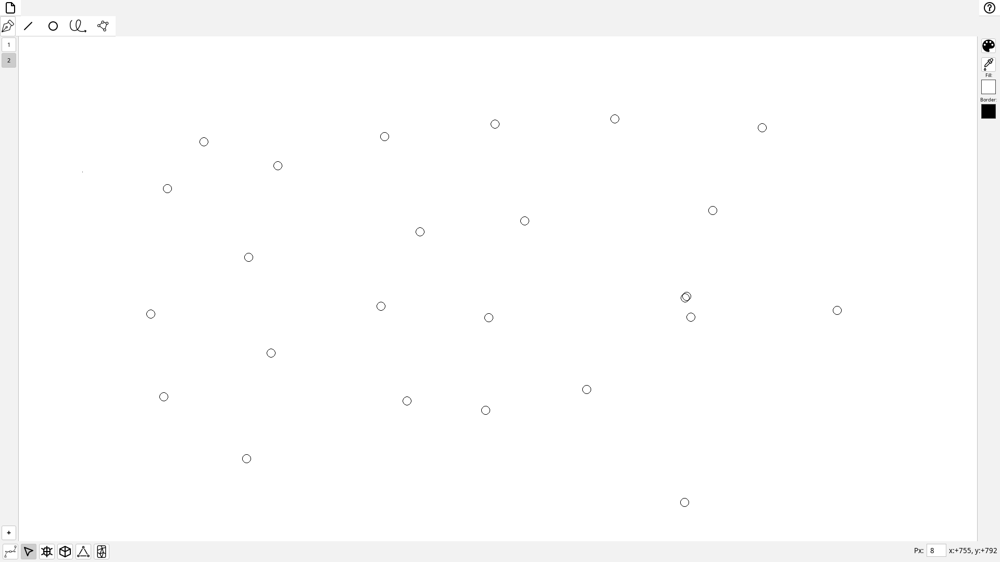

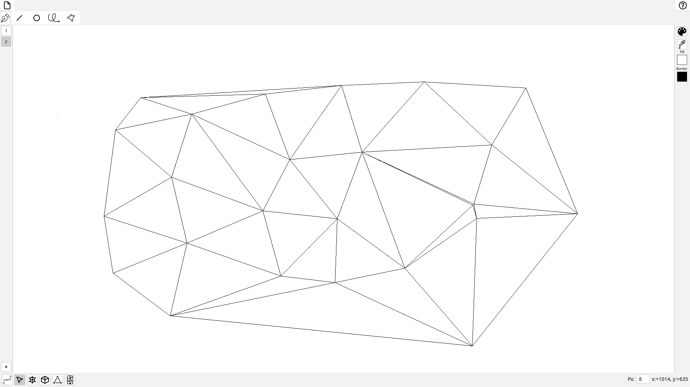

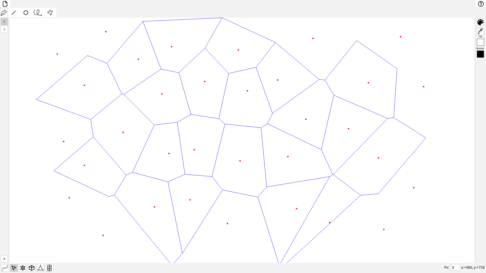

### 3D Modeling

- Load `.obj` format models
- Perspective projection
- Transformations: rotation, scaling, translation
- Face and edge rendering

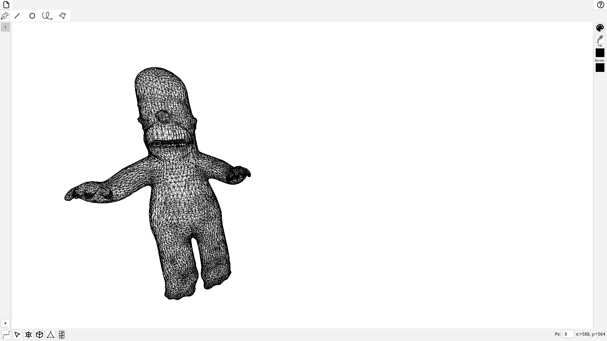

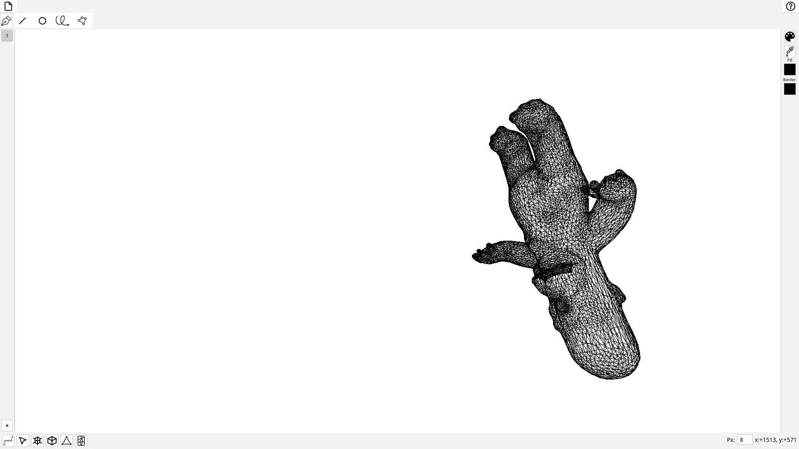

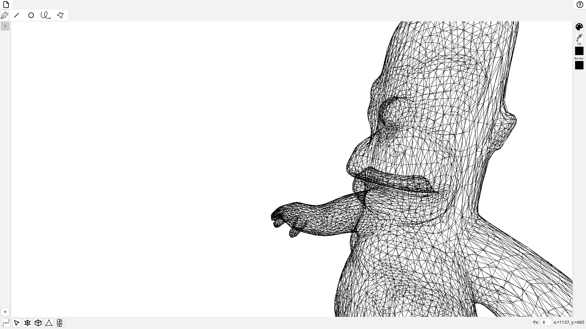

### Files

- Save/load scenes in `.giis` format
- Export 3D models to `.obj`

### Debug Mode

- Step-by-step algorithm execution

### Morph Mode
- Сhanging the shape of figures based on anchor points 
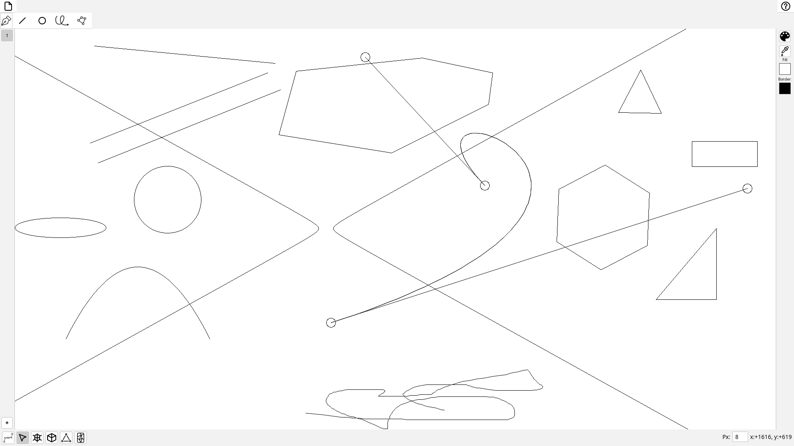

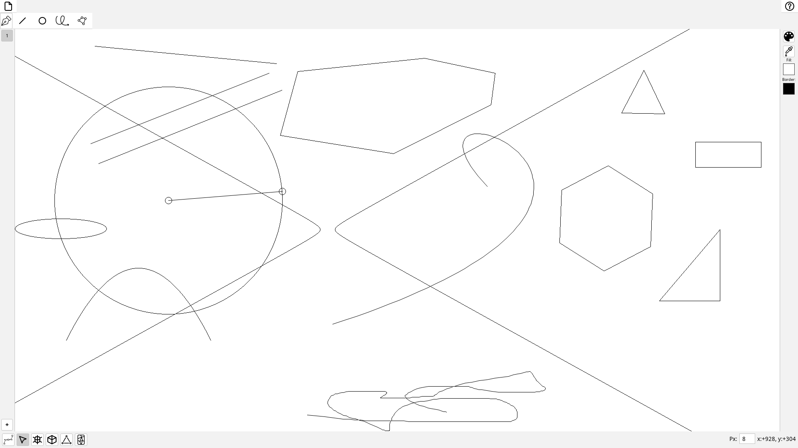

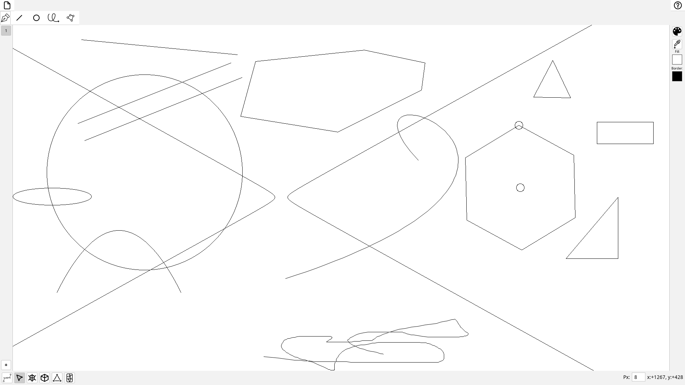

## Build & Run

```bash
./mvnw clean install   # build
./mvnw exec:java     # run
```

## Keyboard Shortcuts

Use the toolbars to select modes and tools.